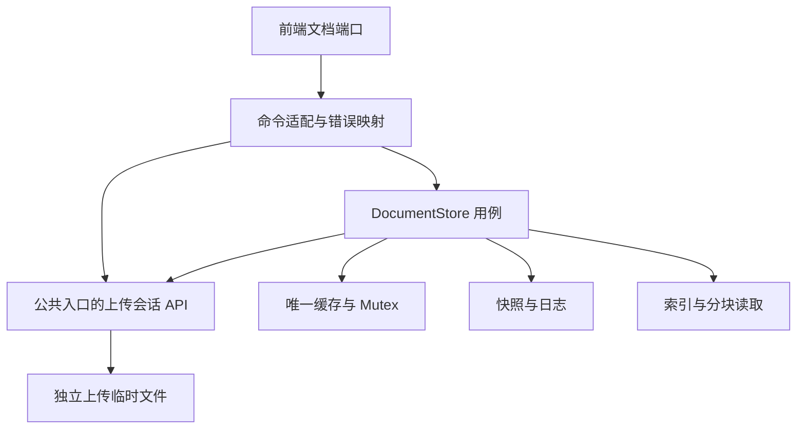

# R11-14 — Commands 与专属 Actions 门禁

## 状态与范围

- 日期：2026-08-28；沿用 `agent/r11-stage`，实现基线为 `325c8383f2c7c4dbbb69a07a0b4e3990d117847e`。该基线已经拆出五个 command 文件，但仍由命令直接操作缓存、锁、恢复标记、索引和删除逻辑。
- **当前状态：R11-14 已完成验收。** 提交 `2664fb0f7fb929c80454510b43a894af6ddda8a8` 的 [Actions #33190952317](https://github.com/uniquenesssta/mdr/actions/runs/33190952317) 于 2026-08-28 成功：前端与 Rust 两个 job 的全部步骤均为 success。用户确认已绿，本次核对该既有结果并补齐记录；不是重新运行或追踪后续 CI。阶段 11 尚未整体完成，允许开始 R11-15。
- R11-14 实施时未推进 11.15，未创建 `store.rs`、不调整 Mutex 与文件 IO 的先后顺序；现有 store 编排仍在 `document_store.rs`，后续锁范围优化单独实施。

## 文件与职责

| 文件 | 本轮变化 |
| --- | --- |
| `src-tauri/src/document_store/commands/{save,load,delete,search,snapshot_upload}.rs` | 仅接收参数、解析存储根目录、调用 store 公共入口、调度阻塞任务与映射原有错误；删除缓存、锁、文件删除、索引和恢复策略的直接访问。 |
| `src-tauri/src/document_store.rs` | 为现有 `DocumentStore` 增加命令用例方法；`Clone` 只克隆同一个 `Arc`，没有新增缓存权威。将原命令中的完整策略移回现有 store 编排，上传 begin/append/abort 通过根入口引入既有函数。 |
| `src-tauri/tests/support/document_store_command_contracts.rs` | 新增 12 个真实 store 回归测试，以 test-only 子模块编入生产 store，使用实际 DTO、快照、日志、索引及上传实现，不另写一套存储实现。临时目录由测试独占并回收。 |
| `tests/fixtures/document-store-commands.json` | 从 R11-13 提交 `10c0387d3b286400ceda8d3161193c7aa46cbd80` 提取 10 个原始签名、join 错误文案及 DTO/前端传输文件哈希。 |
| `tests/stage-11-document-store-commands.test.mjs` | 新增 6 个签名、注册、边界、错误、冻结文件哈希和 Actions 配置守卫。 |
| `tests/unit/platform/document-store-client.test.mjs` | 原有 10 个前端传输契约保留；过时的单体源码断言改为读取已拆分的 types 与 command 文件，没有删除断言。 |
| `.github/workflows/r11-14.yml` | 新增当前分支 push 自动触发及手动触发的 R11-14 验证；不修改早期已冻结工作流。 |
| `README.md`、本记录与阶段 11 任务书 | 更新本轮实现、真实验证结果、待核验项和边界；没有勾选尚未通过验收的任务。 |

原五个 command 文件已存在，本轮没有创建第二份命令实现；`main.rs` 的十条定义模块路径注册保持不变。没有变更生产依赖、manifest/lock、前端生产代码、Serde DTO、历史磁盘夹具、快照/日志/上传文件名或错误文案。

## 保持的行为与测试证据

- 命令名、参数名/类型、返回类型、默认 camelCase 与每个后台任务错误前缀逐项对照 R11-13；前端 invoke 参数映射继续执行原测试。
- 缓存仍只有一个 `Arc<Mutex<HashMap<...>>>`；克隆命令工作句柄共享同一缓存。锁损坏错误在 save/load/manifest/chunk/search/delete/commit 路径保持一致。
- 保存全量/增量、版本冲突、索引失效、空文档与不存在文档、UTF-8 分块、UTF-16 搜索位置和 wrap 语义由真实 store 测试覆盖。
- 三组冻结磁盘夹具复制到独占临时目录后，通过生产 store 加载；验证内容、标题、版本、恢复提示、搜索位置。两个快照均损坏时，各读取用例保持原始错误。
- `recovered`/`recoveryMessage` 仍只在首次 load 或 manifest 中消费，覆盖两种调用次序。
- 空查询仍在根目录解析前返回 `None`，包括无效 document ID；非空查询的根目录解析错误保持不变。命令只消费 store 预检结果，不自行解释查询。
- 上传会话隔离、abort 幂等与清理、commit 冲突时保留待提交文件、缺失会话错误均有覆盖。commit 仍先检查 `fullContent` 冲突，再 take/清理临时文件，最后取缓存锁保存；没有在本轮更改历史失败顺序。
- delete 仍先移除缓存再删除目录，保持幂等及原文件系统错误前缀。

## R11-14 实施时的本地验证（历史记录）

| 检查 | 结果 |
| --- | --- |
| `node --test tests/stage-11-document-store-commands.test.mjs tests/unit/platform/document-store-client.test.mjs` | 16/16 通过。 |
| `npm test` | 350/350 通过；原 344 项保留，新增 6 项。 |
| `npm run build` | 通过，Vite 生产构建完成。 |
| `npm audit --audit-level=high` | 通过，0 vulnerabilities。 |
| `npm run verify:architecture`、`npm run verify:no-legacy-runtime`、`npm run verify:generated-files`、`npm run verify:readme-record` | 四项提交前复验全部通过，包含已加入 Git 索引的新文件。 |
| Rust 1.88 对应 `rustfmt --check --edition 2021 --config skip_children=true` | 通过；覆盖 store 根文件、main、commands 入口/五个模块及新增原生契约测试。 |
| 工作流 YAML 解析、`git diff --check` | 通过。 |
| `npm run test:browser:contract` | 未能启动：本地没有 Chromium/Chrome，提示需设置 `CHROMIUM_PATH`；不能算通过。 |
| `npm run test:browser` | 同样缺少浏览器，未在本地运行。 |
| 原生 12 项契约、5 项兼容、全量 Cargo tests、Clippy、Cargo check | 本地没有 Cargo；未运行，待 Actions。rustfmt 只验证格式/可解析语法，不能替代编译或运行。 |

本地 Node 为 24.19.0；Actions 固定 Node 22、Rust 1.88.0。依赖使用仓库既有 `npm run deps:prepare`，安装到仓库外的父目录，没有改变依赖位置约定。正式桌面 GUI/Tauri release build 本轮未执行，不能以 Node 传输测试或浏览器测试冒充原生端到端验收。

## Actions 交付与验收

- R11-14 实施时工作流在 `agent/r11-stage` 的相关文件 push 时自动触发，也保留 `workflow_dispatch`；两个 job 均 checkout 精确 `${{ github.sha }}`，记录提交并校验它包含本轮基线，避免验证到默认分支或旧提交。
- 前端 job：锁定依赖安装、安全审计、16 项定向测试、全量 Node、四项架构/文档门禁、浏览器 contract、生产 build、built-app 浏览器回归。
- Rust job：安装 Linux Tauri 系统依赖，固定 1.88.0 工具链，检查边界文件格式；运行真实 store 契约并硬断言 12/12、冻结兼容并硬断言 5/5，随后全量 `cargo test --locked`、`cargo clippy --locked --all-targets -- -D warnings`、`cargo check --locked`。
- 全部命令保留失败状态；日志管道启用 `pipefail`。权限仅 `contents: read`，CI 不自动修改、提交或推送代码，最终检查 tracked diff 为空。
- 不论成功失败上传分别命名的前端/Rust 日志及目标 SHA，保留 14 天，便于稍后查看失败证据。
- [R11-14 成功记录](https://github.com/uniquenesssta/mdr/actions/runs/33190952317)：真实 store 12/12、冻结兼容 5/5、全量 Rust/Clippy/check、前端与浏览器门禁均成功。实施时的本地缺项已由该次 CI 补足；正式桌面 GUI/Tauri release build 仍未执行。
- 后续 CI 收口：已完成阶段的 Stage 0–7、R10-11、R10-12 和 R11-03 workflow 保留 `workflow_dispatch`，但不再监听 `pull_request`；它们的历史验证内容与旧分支 push 触发（如有）没有删除。R11-14 改为监听 `.github/workflows/**`，所以当前分支的 workflow 配置改动仍由当前门禁验证，避免后续 PR 同时产生无关的历史红项。

后续进入 R11-15 后，自动分支门禁由 `r11-15.yml` 接管；`r11-14.yml` 保留手动复验及既有硬门禁，测试筛选路径随 Store 迁移更新。

## 架构核对与后续边界

依项目工具协议查询了 Context7 的 Tauri v2 命令注册/参数命名及 GitHub Actions 触发文档，并结合本仓库锁定版本与已有入口核对；通过 Mermaid Chart 梳理实际调用链。图只描述本轮已实现的链路，不表示锁已跨 IO 解耦。

R11-14 的原生与浏览器门禁已通过；剩余结构问题是历史 store 在锁内执行 IO，交由 R11-15 处理。R11-14 不包含正式桌面 GUI/release build，阶段 11 的最终目录入口切换仍属于 R11-16。若需回退，可 revert 本轮补齐提交；不改写分支历史，亦不回滚用户的基线提交或 R11-13 已有工作。
