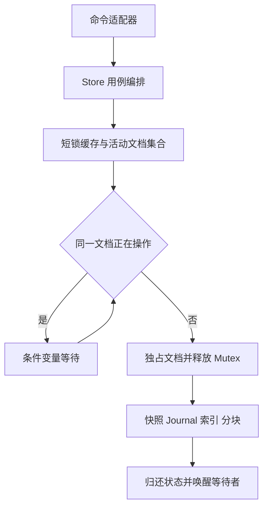

# R11-15 — Store 与缓存锁边界

## 状态与输入

- 沿用 `agent/r11-stage`，实现基线 `6c07582fb0e4968d119b3a74dba28afc49134c5e`；开始时工作区干净。
- 前置 R11-14 已通过 [Actions #33190952317](https://github.com/uniquenesssta/mdr/actions/runs/33190952317)，验收记录独立提交。
- R11-15 已完成验收：提交 `c9377d9d6653e863056ad6aa1524749a283c8b2b` 的 [Actions #33194155165](https://github.com/uniquenesssta/mdr/actions/runs/33194155165) 两个 job 与全部步骤成功，包含 Store 12/12、并发 8/8、冻结兼容 5/5、全量 Rust tests、Clippy/check、Node、架构、构建及浏览器回归。允许开始 R11-16。

## 实现范围与状态所有权

| 文件 | 职责与变化 |
| --- | --- |
| `src-tauri/src/document_store/store.rs` | 唯一 DocumentStore 用例编排：保存、加载、manifest、分块、搜索、删除、上传提交。持有同一个 Arc 缓存句柄，复用已拆分的快照、journal、索引和分块模块；无直接 MutexGuard、文件系统原语或 Tauri 依赖。原 3 项存储回归随实现迁入，没有复制实现。 |
| `src-tauri/src/document_store/cache.rs` | 运行时 StoredDocument、缓存 map、活动文档集合和 Condvar 的唯一所有者。短锁下取出文档，归还时恢复状态；活动期间只存在一个拥有正文的 lease，不克隆大文档，不产生第二份权威缓存。此模块不允许文件 IO。 |
| `src-tauri/src/document_store/index/{mod,builder}.rs` | 将惰性索引缓存归还 StoredDocument，原构建算法不变、原缓存测试原样迁移；纯索引层不再反向依赖运行时缓存类型。 |
| `src-tauri/tests/document_store_compatibility.rs` | 保留冻结词汇与夹具断言，将 UTF-16 词汇查找指向现存 `index/search.rs` 的生产实现，不依赖已迁出的旧入口测试代码。 |
| `src-tauri/src/document_store/repository.rs` | 接收原有“存在则读取”和“存在则删除目录”原语；检查顺序、系统错误与错误前缀保持不变，不接管恢复决策。 |
| `src-tauri/src/document_store.rs` | 保留子模块声明、公共类型入口和原有 Tauri 根路径解析，不再包含 Store、缓存、保存/恢复实现。最终替换成目录 `mod.rs` 留给 R11-16。 |
| `src-tauri/tests/support/document_store_command_contracts.rs` | 保留全部 12 项真实命令用例；仅更新内部缓存查询、测试入口和共享夹具可见性，补充损坏锁与非法 ID 的错误优先级。 |
| `src-tauri/tests/support/document_store_concurrency.rs` | 8 项独立并发回归，复用既有 TestRoot 与请求构造，不引入替代存储实现。 |
| `.github/workflows/r11-15.yml` | 接管本分支自动门禁，固定事件 SHA、Node 22/Rust 1.88，保留日志、硬失败与只读权限。R11-14 保留手动复验，只更新迁移后的测试模块定位。 |

未改变 10 个 Tauri 命令签名、注册、DTO/Serde、前端端口、快照 A/B 与 journal 磁盘格式、上传文件名、生产依赖或锁文件。历史冻结夹具保持原字节。

## 并发、失败与兼容

- 相同规范化文档 ID 的用例保持串行，包含首次加载/恢复、读取、写入、索引构建和删除；条件变量等待释放 Mutex，唤醒后重新检查谓词。
- Windows/macOS 上可能指向同一目录的 ASCII 大小写别名共用活动占用键；原缓存键、返回 ID 和目录名不改写，避免拆锁后出现同目录并发写。
- 不同文档可以并行执行文件 IO。Mutex 只保护缓存移动和活动集合，不跨文件读写、快照提交、journal 重放或大文档索引计算。
- 保存全量/增量、版本冲突、快照阈值、UTF-16/字节偏移、恢复提示一次性消费与删除先驱逐缓存的原有行为保持。
- 所有正常/错误返回均由 lease 的 Drop 归还状态并唤醒等待者。用例 unwind 后缓存保持失败关闭，继续返回原有“文档存储锁已损坏”，不吞异常或清除 poison。
- 保留原有 IO 失败后的内存状态语义；本任务没有借锁拆分引入数据格式迁移或新的事务回滚策略。
- 上传 begin/append/abort 仍属于既有独立会话实现；commit 保持先校验、读取并清理上传、再进入保存用例的顺序，没有扩大其历史锁范围。

## 验证

| 本地检查 | 实测结果 |
| --- | --- |
| Rust 1.88 生产存储模块测试 | 99/99 单元通过，包含原 12 项命令用例和新增 8 项并发回归；独立冻结兼容 5/5 通过，共 104 项；8 项并发测试另重复 10 轮，均通过。 |
| `npm test` | 353/353 通过；原 352 项保留，新增 Store 边界检查 1 项。 |
| 命令/工作流/前端端口定向测试 | 19/19 通过。 |
| `npm run build` | 通过。 |
| `npm audit --audit-level=high` | 通过，0 vulnerabilities。 |
| 四项 `verify:*` 门禁 | architecture、no-legacy-runtime、generated-files、readme-record 通过。 |
| Rust 1.88 `rustfmt --check`、YAML 解析、`git diff --check` | 通过；覆盖本轮全部 Rust 文件。 |
| 完整仓库 Cargo test/Clippy/check | 本地缺少 Linux Tauri 系统构建环境（包括 pkg-config）；未在本地完成，交由 Actions，不能把存储模块测试当成全量 Tauri 验收。 |
| 浏览器 contract/app | contract 启动报缺少 Chromium/Chrome；app 同样未在本地运行，两项均交给 Actions。 |
| 正式桌面 GUI/Tauri release build | 本轮未执行。 |

本地使用仓库外临时 Cargo 编译入口，按绝对路径引用真实 `cache/store/snapshot/journal/index/chunks/types/validation/paths/repository` 生产文件及既有测试；Serde 版本和传递依赖来自仓库 Cargo.lock，夹具只在独占临时目录使用。没有复制存储算法、Mock 文件系统或变更生产依赖；此入口不包含 Tauri 命令宏和其他 Rust 功能，因此不替代完整仓库门禁。初次兼容复验发现旧入口文本定位失效，修正到实际索引模块后 5/5 通过。

### 8 项并发覆盖

1. 持有文档操作权时 Mutex 已释放，另一文档真实保存可完成；大小写目录别名仍等待同一操作权。
2. 同版本并发增量只有一个成功，其余保留 VERSION_MISMATCH；磁盘和缓存内容一致。
3. 规范化 ID 相同的 8 次全量保存严格产生版本 1–8，最终 A/B 槽仍可读取。
4. 同时 load/manifest 恢复旧夹具，恢复提示只消费一次。
5. 真实临时文件创建失败后归还内存文档，后续重试不挂起并可落盘。
6. 用例 unwind 不遗留活动占用，等待者及后续调用收到原有锁损坏错误。
7. 冷加载与删除并发后无旧缓存复活。
8. Linux/Unix 使用真实 FIFO 阻塞生产 journal 读取，在释放 FIFO 前验证另一文档已完成磁盘保存；不以 sleep 或 Mock 代替慢 IO。该场景在 Ubuntu Actions 中必须计入 8/8。

## Actions 与回退

- [R11-15 Document Store](https://github.com/uniquenesssta/mdr/actions/workflows/r11-15.yml) 已完成上述验收，现保留手动复验入口；R11-16 接管本分支自动门禁。R11-14/R11-15 历史门禁均未删除。
- 先运行 12/12 命令契约、8/8 并发契约与 5/5 冻结兼容，然后完整 `cargo test --locked`、`cargo clippy --locked --all-targets -- -D warnings`、`cargo check --locked`；前端继续全量 Node、架构、构建、安全审计与两类浏览器门禁。
- 不加入 `continue-on-error`，不降低数量断言；日志管道保持 `pipefail`，成功/失败都上传证据，验证后检查 tracked diff。
- 回退仅 revert 本 R11-15 实现提交；不回滚 R11-14 已绿验收或用户基线，不改写远端历史。磁盘格式未变，无迁移步骤。

## 架构依据

Context7 核对了标准 `std::sync::Condvar::wait` 的释放/重取锁、谓词循环与 poison 语义；仅使用 Rust 1.88 可用的稳定标准库，不采用检索结果中的 nightly nonpoison API。Mermaid Chart 已显示本轮真实模块关系。

