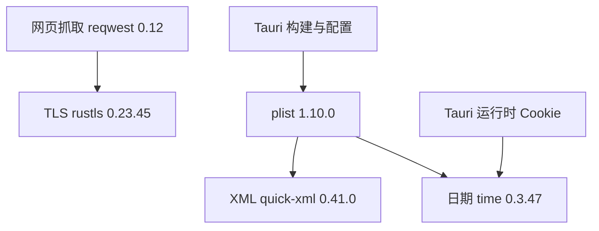

# R12-23 Windows 依赖公告处置（A10）

状态：R12-22 的精确提交 `ccaf7af` 已通过 Windows 累计 5/5 与原生安全/合法内容验收；本项兼容依赖升级及验证已实施，待新的 Windows CI，A10 仍开放、12.23 不勾选、12.24 未开始。唯一分支 `agent/r12-stage`。

## 官方公告与兼容升级

2026-09-30 重新读取官方 RustSec 数据库提交 `9b3a3b73a7f42606494c943e95f8196e9994df46`（当日 07:15:39 UTC），逐条核对原审计的十二个候选。使用官方 Cargo 1.88 `update -p … --precise …` 生成锁文件，未手写校验和，未更改 Cargo.toml、生产调用、Tauri/reqwest 主版本或启用特性。

| 公告 | 原版本 → 当前锁版本 | 处置与范围 |
|---|---|---|
| RUSTSEC-2026-0285 | rustls 0.23.41 → 0.23.45 | 修复 TLS 1.3 加密层边界错误；Windows reqwest HTTPS 使用链确实存在 |
| RUSTSEC-2026-0009 | time 0.3.41 → 0.3.47 | 修复 RFC2822 解析栈耗尽；当前具备 parsing 特性，直接升级，不依赖不可达假设 |
| RUSTSEC-2026-0194/0195 | quick-xml 0.38.4 → 0.41.0 | 通过兼容 plist 1.7.4 → 1.10.0 引入；处理属性重复检查的平方复杂度及命名空间无界分配 |
| RUSTSEC-2026-0185 | quinn-proto 0.11.14 → 0.11.15 | 修复流重组内存耗尽；不启用 HTTP/3，兼容修复可选锁条目，后续启用仍须重验 |
| RUSTSEC-2024-0429 | glib 0.18.5 保留 | Unix/GTK 链的 unsound API；必须由 Windows normal/build 目标图确认不存在，若进入目标图即失败 |
| 六条 unmaintained | proc-macro-error 与五个 unic 包保留 | 每条公告 ID、包名、精确版本、处置原因及 R13/R17 复核责任分别登记；维护提示不改称已修复漏洞 |

必要支撑项：rustls-webpki 0.103.13 → 0.103.15、deranged 0.4.0 → 0.5.8、num-conv 0.1.0 → 0.2.2、time-core 0.1.4 → 0.1.8、time-macros 0.2.22 → 0.2.27。共十个 package 条目有兼容升级，没有无关批量更新。新 time/plist 的 MSRV 为 1.88，沿用现有 Rust 1.88.0。原始发现保留在 [原候选清单](audit/rust-advisory-candidates.json)；当前逐条来源、锁版本和待验收状态见 [处置记录](audit/r12-23-dependency-advisories.json)。

## Windows 硬性验证

继续使用 `.github/workflows/r12-14.yml`，保留此前全部五个 Windows job，另加本项公告 job。官方 cargo-audit 0.22.2 Windows 发行包按 GitHub 官方 release SHA256 校验；公告库 fetch 精确提交、checkout 并复核 SHA，扫描完整 Cargo.lock，不传 ignore、不关 yanked 检查。任何漏洞、扫描失败、缺失/矛盾报告、新未评审维护提示或警告均阻止验收。只有已逐条登记的维护提示和经 Windows 图确认不存在的精确 glib 提示可记录为对应结论。

目标图来自 Windows 上 `cargo metadata --locked --filter-platform x86_64-pc-windows-msvc`，保留 normal/build 路径和特性、排除 dev-only 路径，核对实际 rustls 请求链与 MSRV；完整 Cargo feature tree 另存证。metadata 在可选依赖/不同编译职责的特性表达上可能保守，不以它单独断言某个 API 可达或 HTTP/3 已启用；原生编译、既有功能及行为回归仍必须全部通过。Cargo.lock 及跟踪源码不得在验证中被改写。

现有 `web_fetch::client::tests` 增强真实 TLS 回归，仍为两项客户端测试：自有 Node loopback HTTPS server 仅支持 TLS 1.3；测试客户端加入专用 CA 后必须完成真实握手并读取中文/emoji 正文；实际生产 `build_client()` 对同一未信任 CA 必须连接失败。测试没有关闭证书验证、安装系统根证书或访问外部站点；公开测试 key/cert 仅作夹具，服务进程由 Rust Drop 清理。生产客户端、默认根证书、请求头、30 秒超时和重定向规则不变。证书有效至 2036 年，R17/未来长期维护需复核有效期。

已有实际 HTTP/压缩/超时、Rust 全量、Clippy、前端构建、浏览器和 R12-22 WebView 安全/正常内容回归继续保护升级影响。八项公告判定回归覆盖漏洞、忽略条目、坏报告、glib 进入 Windows build 图、dev-only 边、未知维护提示、MSRV/锁版本回退和累计门禁。原始 scanner JSON、stderr、metadata、feature tree、source SHA、database SHA 和判定 JSON 即使失败也上传 `r12-23-dependencies-<SHA>-<attempt>`。

## 当前结果与后续

本地执行的是锁文件/依赖源静态核对：官方 Cargo 1.88 精确更新与 Windows-target metadata 均成功；官方 cargo-audit 0.22.2（发行 digest 已核对）针对当日库扫描完整锁文件，漏洞 0、维护提示 6、glib unsound 提示 1。目标 metadata 未出现 glib，已解析 normal/build 包的声明 MSRV 无超过 1.88。scanner 在 no-fetch 模式未填 last-commit，数据库身份另由 git rev-parse 的精确 SHA 验证，未将空值伪作证据。

只进行 JS/Rust 语法与格式、actionlint/YAML/bash、JSON/证书签名/导入/差异等静态检查；未在 Linux 运行产品测试、构建或 TLS/WebView 行为验收。全部动态结果待本批精确提交的 Windows CI，不能提前关闭 A10。

Context7 查询 Cargo 定向更新/metadata 和 reqwest CA API；其索引为当前官方文档，reqwest 当前 master 的废弃提示不套到本仓库 0.12.28，已结合实际下载的精确包源码确认 API 无此废弃标记。Mermaid Chart 已绘制实际升级依赖链。后续 R13.1 新 XML/日期/HTTP3 调用须重新核对公告和特性，R17.8/17.9/17.17 重新扫当日官方库；已有接收文字保持。12.24 必须核对本项 Windows 结果才能收官。

推送启动 Actions 后结束、不轮询；约 15～20 分钟后发起“查询 R12-23 CI”。

