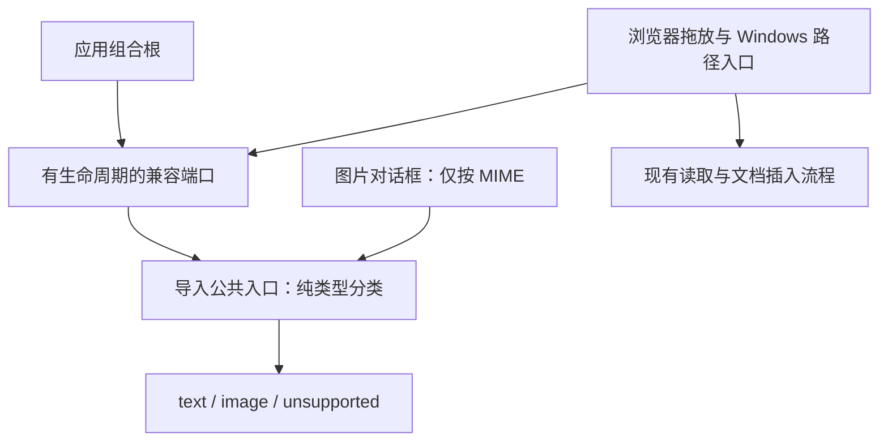

# R13.2 导入类型分类器

状态：**实现已提交，待本轮精确提交 Windows CI；尚未验收**。唯一分支 `agent/r13-stage`。前置 R13.1 已在 `3c299591b11dda238b212be68c9b6beb5b8a7726` / [Windows CI 36801548407](https://github.com/uniquenesssta/mdr/actions/runs/36801548407) 验收（7/7 job、Node 1513/1513、Rust 268/268）；该提交也是本项回退代码基线。

## 实际变更与公共契约

- 新增 `src/features/import/files/file-type-classifier.js`，通过 `src/features/import/index.js` 公开冻结的 `IMPORT_KINDS`（text/image/unsupported）、`classifyBrowserFile(file, { imageOnly })`、`classifyImportPath(path)`、`classifyImportResult(result)`。仅检查元数据，不读取内容、大小或平台能力，不持有状态，无异步或销毁资源。
- `public/app/events.js` 浏览器拖放与 Windows 路径路由改用同一个分类器，删除原扩展名数组、MIME 判断与重复分类代码；首文件、原读取调用、错误提示、最近文件登记和文档创建顺序保持。
- `src/features/editor/ui/image-dialog-view.js` 通过 Import 公共入口调用 MIME-only 分类，保留图片对话框与普通拖放不同的优先级。没有侵入 Import 内部路径。
- 新增 scoped `classic-import-classifier-port.js`，由 `src/main.js` 在经典脚本加载前挂载，pagehide 和异步启动失败时销毁；重复挂载拒绝，销毁幂等，旧 API 销毁后拒绝调用。端口只转交纯分类，无文件读取/状态副本，也不创建 window 全局。13.4 完成旧拖放调用者迁移时删除此桥接，不扩展为导入 service locator。
- 生产模块清单精确追加三个新模块；原模块、冻结模型、Rust、持久化格式、依赖锁文件与权限均未修改。Windows 工作流只更新本项显示名，原七个任务与失败门禁保持。

## 兼容边界

| 输入 | 分类规则 |
|---|---|
| 浏览器 drop File | md/markdown/txt 名称优先，扩展名忽略大小写；其余仅 image/* MIME 为图片，空 MIME 的 png 不自动认作图片 |
| 图片对话框 File | 仅 image/* MIME；名为 note.md 但 MIME image/png 仍为图片，不被文本优先规则截走 |
| Windows 路径 | 去首尾空格后只取最后一段；文本三种，图片 png/jpg/jpeg/gif/webp/svg；BMP 不支持 |
| 已返回 DTO kind | 只接受精确 text/image；未知/缺失 kind 返回 unsupported，不根据名字、MIME、content 猜测 |

保留旧 split/pop 语义：名为 md 或 .md 的文件仍按旧入口判作文本；MIME 大小写/空格不额外归一化。无效元数据安全返回 unsupported。浏览器文件选择器的 loadFile 原先不二次限制类型，本项不增加新拒绝条件。分类器不是安全验证器；Rust 的权限/实际字节/类型边界继续执行，未将后端平台层反向依赖前端 Feature。当前 FilesPort 返回正文或 Data URL，原始返回 kind 的纯适配契约由本项测试固定，供 13.3 的协调层使用，不声称现有调用链新增了原始 DTO 消费者。

大小限制和取消缺口保持 R13.1 的责任分配：浏览器 5 MiB、对话框 2 MiB 确认、native 图片 20 MiB 差异不在本项统一；图片异步取消/晚回调归 13.4/13.7，网页 A05/R13-S01 仍待实施。A10 无新增依赖特性、解析/抓取能力。

## 验证与旧测试映射

新增 `tests/stage-13-file-type-classifier.test.mjs` 七组契约：File/MIME 优先级、路径及扩展名、返回 kind、非法输入/不可变性、不读正文和大小、端口销毁与重挂载、生产入口接线。原 `stage-13-import-matrix.test.mjs` 20 项行为保留，注入真实公共分类器代替已迁出的旧分类段；另补一项真实 image-dialog-view 的 MIME-only 冲突路由，继续验证读取/插入行为。

对应关系：原 events 原文执行中的内联分类 → events 原文路由调用真实公共分类器 → 保留支持类型、优先级、阈值、首文件、失败/取消和最近文件断言。没有删除失败场景、跳过测试或复制一份分类实现来测试自己。

本地只运行改动 JS/MJS 的 `node --check`、JSON/差异及模块清单静态核对，不执行 Linux/macOS 产品测试。本项行为、完整前端/架构/浏览器、Rust、原生/WebView 与依赖回归由现有 Windows CI 执行，启动后不轮询；新提交成功前不勾选 13.2，也不推进 13.3。

## 实际链路

Mermaid Chart 已用于复核上述真实依赖关系；未引入第三方库/API，无需新增版本文档查询。
