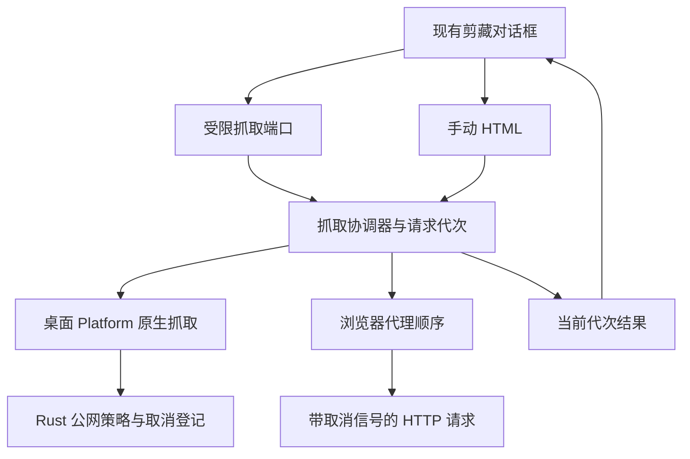

# R13.9 Web Fetch Coordinator

状态：**已实现，待 Windows CI，未验收**。唯一分支 `agent/r13-stage`，基线为 R13-S01 已验收提交 `74abbd291c32bc125b4f151bd98d337f55e4e54e` / [Windows CI 36890098604](https://github.com/uniquenesssta/mdr/actions/runs/36890098604)，七组成功。用户于 2026-10-02 授权“S01 收尾并开始 09”。不实施 13.10 HTML 提取、13.11 转换或后续整体对话框迁移。

## 实际职责与调用链

- `src/features/import/web-clipper/web-fetch-coordinator.js` 唯一拥有原生/本地代理/公共代理的路径选择、单次请求代次、取消与总截止；提供手动 HTML 入口，返回不可变 success/manual-required/empty/cancelled 结果。没有 DOM、编辑器或 Markdown 转换依赖。
- 应用组合根注入原生 `platform.web.fetchText(url, {signal})` 及浏览器 fetch。桌面失败直接要求手动 HTML，禁止自动落入公共代理绕过 S01 后端策略。
- 浏览器保持本地代理默认地址、html/content 兼容、错误 hint，以及 allorigins raw → allorigins JSON/base64 → codetabs 的顺序和 100 字符门槛。新增整个请求共用 30 秒截止；取消后不开始下一代理。此兼容路径不声称具备 Rust 的 DNS/IP、MIME 或正文大小安全保证，不将代理服务成功视为原生安全验收。
- `classic-web-fetch-port.js` 管理有限接口及输入监听寿命；在 13.12/13.14 随旧对话框迁移删除。旧 web-clipper 仅负责读取控件和展示结果，不保留第二份抓取逻辑。对话框关闭、重新打开、URL/代理/手动输入变化、新抓取及应用销毁均取消或使旧代次失效；返回到 UI 时再检查代次，避免已完成 Promise 的旧结果回填。
- native AbortSignal 接通已验收的取消 IPC。协调器立即隔离旧结果，底层取消失败仍由注入诊断回调明确报告；不宣称浏览器取消可以终止第三方代理服务内部的远程任务。原生请求继续受 Rust 总截止约束。
- 抓取错误及代理 hint 改为 `textContent`，保留原有翻译与文字含义，禁止把远程错误消息当作 HTML 执行。HTML 正文本身仍属于不可信输入，提取/转换与安全渲染后续验收不变。

图描述本次实际调用与所有权；取消状态不存入公共全局，已有 fetchedHtml 仅保留旧 UI 当前内容，后续随对话框迁移处理。未增加生产依赖，未改变模型或持久化格式。

## 验证及旧断言迁移

- 协调器回归覆盖桌面优先且失败不降级、成功/空内容/失败、代理顺序、JSON/base64、错误提示、空输入/预先取消、父取消、新请求覆盖、手动输入和销毁、总截止、native 请求 ID 一致及取消失败诊断。
- 旧 R13.1 VM 用例由“截取经典网络实现”改成“旧 UI 调用真实协调器”，保留桌面成功/失败且禁止公共回退的行为目的。Platform 契约由经典脚本中的 fetchText 字符串，迁移到组合根注入和 UI 端口消费，保留原生适配唯一性。
- 新增真实 Chrome + 自有 HTTP 服务测试：本地 JSON 正文、公共回退的受控 HTTP 响应、流式未完成正文取消后服务端观察连接关闭。公共地址仅映射到自有服务，不访问第三方代理；这证明浏览器 HTTP/Abort 行为，不证明公共服务可用性，也不替代真实 Tauri GUI 验收。
- 旧 UI 回归验证关闭再打开的晚到结果被丢弃，输入变化清除已抓取内容，错误中可执行标记仅为文本。端口测试验证监听移除、重复销毁与不覆盖新所有者。
- 当前源码风险复核更新 main/web-clipper 指纹并纳入协调器/端口；历史 R12 acceptance 保持不变。A05 继续为全链路未关闭，不重复宣告完整修复。

本地 JS/MJS 语法、架构/旧运行时/生成文件/README、JSON、源码指纹及差异静态检查已通过。首次架构检查因工作区缺少既有依赖失败，按锁文件安装至父目录后重验通过；没有升级或新增依赖。产品行为、真实浏览器和 Node 回归交由既有七组 Windows CI；没有执行 Linux/macOS 产品测试或构建。CI 未通过前不勾选 13.9、不推进 13.10。

## 回退与剩余工作

本项可整体回退到 `74abbd2`，无数据迁移。13.10/13.11 继续接收不可信 HTML 提取与转换，13.12/13.13 完成对话框及文档/Preview/Hybrid 全链路；13.14 删除剩余经典实现和受限迁移端口。新 CI 启动后结束会话，不轮询。
