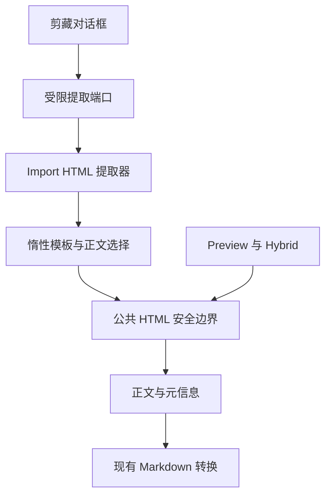

# R13.10 HTML Extractor

状态：**已实现，待 Windows CI，未验收**。沿用 `agent/r13-stage`；13.9 已在 `52b28a0aa8f110f29f712d1ccedbb64cb9ef5f21` / [Windows CI 36894947377](https://github.com/uniquenesssta/mdr/actions/runs/36894947377) 七组通过，closeout 9/9 通过。用户授权“13.9收尾开始13.10”。

## 职责与边界

`html-extractor.js` 同步接收字符串，返回冻结的元信息及脱离页面的正文容器。沿用 title/h1、author、published 元信息优先顺序，以及 article、role main、常见内容类、content ID、main 的正文候选顺序；无候选则保留片段正文。先移除导航、广告、评论等无效节点，避免无效区域内的 article 抢占正文。空输入返回空正文，非法类型抛 TypeError。

原文只赋给 template.innerHTML，其 content 属于惰性文档；不把未净化节点附加到活动 document。序列化也在惰性文档完成。清理后的候选交给既有 `createDocumentHtmlFragment`，不复制 URL、事件属性或 CSS 净化策略。标题等元信息仅作为纯字符串，不插入 HTML。

保持旧提取器剔除图片、视频等资源的产品行为；补清理 object/embed、link/base、模板与元信息节点。相对和危险链接按现有公共安全边界移除 href，合法绝对链接保留；这是接入统一安全规则的有意变化。正文表格、列表、代码语言类及文字格式交由现有边界保留。转换器生成 Markdown 的逻辑保持原状，13.11 再处理转换兼容与编码/协议输出，不能据本项宣称完整 Markdown 再渲染链路已验收。

受限 `classic-html-extractor-port.js` 由组合根挂载，经典剪藏脚本只调用 extract；正常关闭由已有抓取协调器隔离旧请求，提取本身同步无任务/取消状态。pagehide 和启动失败均销毁端口，保留句柄拒绝再用，重复销毁安全，不能删除后继所有者。13.12/13.14 删除迁移端口。

## 验证与覆盖映射

- Windows 真实 Chrome + 自有 HTTP 服务：完整 HTML 和片段、八类候选、导航中的错误候选、空输入/非法类型、实体元信息、危险与相对链接、事件属性、脚本/样式/嵌入资源、自定义元素构造器。将净化正文实际挂入测试页面，断言执行计数和资源请求均为零，表格/格式/代码类保留。
- Node 端口回归：结果与错误透传、重复挂载、销毁/重复销毁、后继所有者；经典入口契约禁止保留旧 DOMParser 和三份旧提取函数。
- R13.1/13.9 VM 测试的截取结束标记由已删除的提取函数注释改为转换器注释，原网络/UI 行为断言保留。新增测试由既有 Windows repository-tests 自动递归发现。
- 顶层当前风险源码指纹更新；历史 R12 acceptance 不变，A05 保持 deferred-not-fixed。不改变模型、持久化或依赖锁文件。

本地仅运行语法、架构/旧运行时/生成文件/README、指纹与差异静态检查，不执行 Linux 产品测试或构建。产品回归交由 Windows CI，通过后再勾选13.10。回退可整体撤销本次实现，无数据迁移。

已调用 Mermaid Chart 绘制本次真实调用链，并通过 Context7 查询 MDN 确认 template content 的独立 ownerDocument 与完整文档标签解析语义。惰性模板语义参考 [MDN template](https://developer.mozilla.org/en-US/docs/Web/HTML/Reference/Elements/template) 与 [W3C Web Components introduction](https://www.w3.org/TR/2012/WD-components-intro-20120522/)；DOMPurify 沿用锁定版本与现有封装，无新增库 API。CI 启动后结束会话，不轮询。

## 首轮 CI 失败与修复（2026-10-02）

`c0ab57b` / [CI 36900988188](https://github.com/uniquenesssta/mdr/actions/runs/36900988188) 未通过。四组 Rust/原生/WebView/依赖任务成功；frontend 与 repository-tests 失败，closeout 因前置任务失败正常阻断。新 HTML extractor 真实浏览器回归已经通过，但不代表整轮验收。

确认两项根因：S01 旧测试仍强制要求 13.9 复选框为空，正式收尾后成为过期断言；Import 公共入口新增 extractor 导出后，原文件/拖放两个源码 ESM 浏览器用例传递加载 DOMPurify，却未配置裸模块映射。

修复将旧断言迁移为 S01 精确验收提交与 Windows CI 证据检查，原历史 manifest 与策略断言完整保留；两个浏览器用例沿用既有 run-browser-tests 的 import map 方案，读取安装版本的 ESM 字节作为 data URL，继续通过 Import 公共入口执行所有原行为断言，不绕开导出、不扩大虚拟文件根、不访问 CDN。生产代码和依赖不变。

本地仅进行语法、README 与差异静态核对；行为回归交给新一轮 Windows CI。13.10 保持未验收，未开始13.11。
