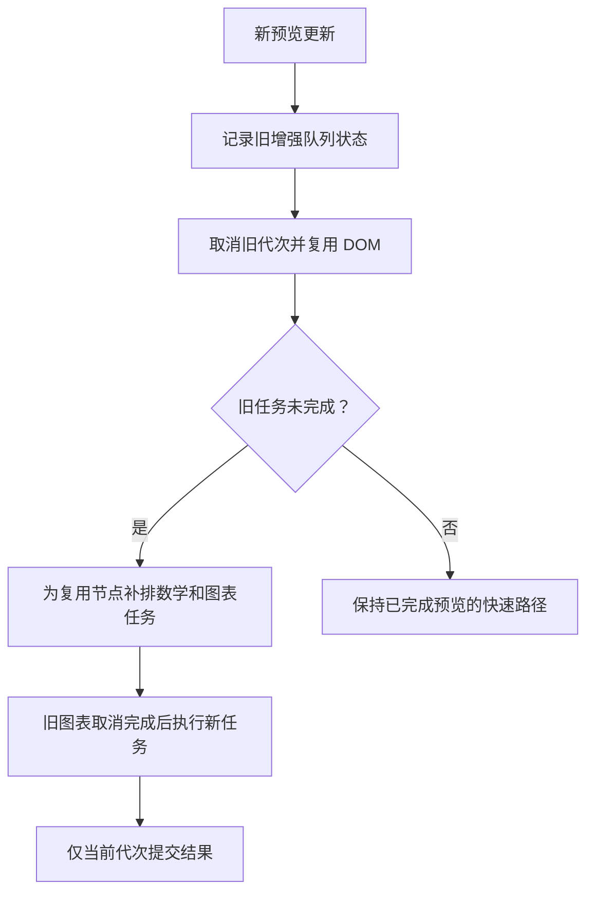

# R14-05 Progress Store/UI

状态：**已在精确提交 `11d2eb4befff4b06a13e2f4f00075ca1db2d056f` / [Windows CI37929409192](https://github.com/uniquenesssta/mdr/actions/runs/37929409192) 七组及全部步骤通过，正式收尾**。同一 `agent/r14-stage`，文档收尾 `45bcdd1` / [Windows CI37931528219](https://github.com/uniquenesssta/mdr/actions/runs/37931528219) 七组及全部步骤成功；按用户“收尾05开始06”启动 [14.6 Document Builder](R14-06-DETAILS.md)，待其独立Windows验收；下面保留实施与两轮失败/修复记录，其历史“待验收”不代表当前状态。

## 正式 Windows 验收（2026-10-09）

同提交run37929409192 attempt1全部成功，最终精确提交汇总accepted=true。全仓16目录1748/1748、前端746/746、进度20/20、新增增强竞态4/4、取消22/22、任务16/16、请求31/31、导出基线41/41、浏览器契约11/11＋实际应用38/38均通过；实际进度探针验证纯文本、焦点、锁定/取消、结束重置与清理。Rust269项＋集成5/1/6项、安全写入18/18、Clippy/check及格式通过。

| Windows组 | job ID | 结论 |
| --- | --- | --- |
| 原生链接边界 | 113816147444 | 成功 |
| 真实WebView导入与安全 | 113816147566 | 成功 |
| Rust专项、全量与格式 | 113816147598 | 成功 |
| 前端与浏览器 | 113816147622 | 成功 |
| 递归全仓Node | 113816147639 | 成功 |
| 依赖公告 | 113816147655 | 成功 |
| 最终同提交汇总 | 113819220874 | 成功 |

WebView产物11615926993，ZIP摘要 `sha256:f3336036ae218e6bfd5adf3f8f177c05b9c1370144b8fe256bb7dcf023ad95b3`；closeout产物11616041430，ZIP摘要 `sha256:85e9bf1dce20377de340a93d353948f35cb5e779c978bd3b3ba44144264864d4`；两份文件均核对摘要和精确提交。本地文件/网页导入的双栏及Hybrid四组分项诊断全部通过，含Markdown、数学、Mermaid、粗体、必需图片/HTML标记，导入全链8/8及原安全断言成功；上轮file/both超时路径本轮已通过。

四项受控交错回归确认增强排队/取消/复用修复；旧失败产物缺少分项快照，因此仍不能事后确定上轮究竟缺哪项或将竞态认定为其唯一原因。本轮通过不改写旧失败。验收仅覆盖本项进度职责与相关Preview修复；F01/F02/F04、F03完整格式产物及A10保持接收。根R12公告快照的成功不代表新low风险已处置。

本次收尾仅更新文档、任务勾选和当前验收记录；生产源码、全部测试、45项源指纹及工作流不变。14.6未开始，R14整体未收官。

## 第二轮 CI 失败与 Preview 增强修复（2026-10-09）

`2dbfc2ba3117d1924cceca40d4dd57e04078265a` / [CI37897676407](https://github.com/uniquenesssta/mdr/actions/runs/37897676407) 已通过全仓1744/1744、前端746/746、进度20/20、取消22/22、任务16/16、请求31/31、导出41/41与浏览器11/11＋38/38；Rust、原生、依赖组成功。唯一直接失败为真实Windows WebView组113712661792的完整导入/预览/安全步骤：本地文件导入成功，`file/both` 合法内容检查在30秒后超时，最终汇总113715096690正确拒绝。首轮计数修复已得到本轮验证，但14.5整体仍未验收。

已核对WebView产物11601461733及ZIP摘要 `8292aaaa0ff2b771e6cba1fd99b70271c1df61fcd9360b38036446b9134d3934`：普通双栏/Hybrid内容、五个攻击面、CSP/原生canary及网页导入双模式已完成，本地文件HTML图片请求已到达自有服务。旧探针只返回聚合布尔值，没有失败DOM或本地文件截图，也在函数抛出时丢失局部导入观察；因此不能从该产物断言究竟缺数学、图表、图片或HTML标记，不能把下述代码缺陷写成本次失败已证实的唯一原因。

源码复核发现可确定的增强竞态：`PreviewRenderEngine.update()` 开始新代次时取消旧增强队列；若Markdown未变而复用同一DOM，原逻辑只补排不带busy标记的Mermaid，可能丢掉未执行数学任务或仍在等待旧代次取消的图表。现先读取已有队列的pending/running；仅在旧增强未完成且复用DOM时，为现有节点补排新代次增强。既有Coordinator串行等待旧任务结束，既有Renderer拒绝旧代次提交，随后新任务完成渲染。补排不播放新内容入场动画；已完成的未变预览继续原快速路径。没有重置文档或用测试重绘掩盖失败。

新增四项Windows Node回归使用实际Engine、Enhancement Coordinator与Mermaid Renderer，注入可控调度器及展示能力，强制覆盖一次/连续三次更新取消排队数学和图表、旧Mermaid保持busy时新更新、以及已完成预览的快速复用。明确断言数学/图表最终完成、旧图表不能提交、无需额外更新即可收敛、恢复不重播动画。DOM/展示替身只证明调度与所有权，不能代替实际WebView像素或库渲染。

探针保留所有Markdown、数学、图表、粗体、图片和HTML标记断言及30秒截止；不重试断言、不增加超时。追加独立诊断字段，记录每次渲染检查的缺失项、图片尺寸、未完成Mermaid围栏/busy/error、Preview状态/文档版本及已完成观察。失败时保存当前截图和诊断后继续抛错；完整导入、安全与精确提交硬门禁保持。

本次生产变更仅现有Preview执行器的取消后补排逻辑；进度Store/View、导出、模型、依赖、Rust、原生命令、数据格式、CSP及工作流不变。当前风险源指纹新增该执行器一项（合计45）；既有44项覆盖保留，43个指纹不变，导入探针更新当前指纹并另存旧值。R12根验收、R13/R14已验收快照保持。Mermaid Chart已记录实际取消/恢复关系：

四项架构/文档静态门禁、4个变更JavaScript语法、JSON、106个相对链接、45项源指纹、历史验收/首轮失败保留及diff复核通过。仅执行静态自检；四项新回归与真实WebView因果均等待Windows精确提交验证，14.5未勾选，14.6未开始。

## 首轮 CI 失败与迁移校验修复（2026-10-09）

`2bbd7733b9c14b4639cf64bde04c21840a7b449d` / [CI37890617533](https://github.com/uniquenesssta/mdr/actions/runs/37890617533) 的进度专项20/20、取消22/22、任务16/16、请求31/31、导出41/41、浏览器契约11/11＋实际应用38/38全部通过，真实进度探针与pagehide移除节点已执行；Rust、安全写入、原生、依赖及真实WebView组成功。递归Node16目录1743/1744、前端745/746，唯一直接失败是 `tests/stage-01-handoff.test.mjs` 的现行inlineEvents总数仍要求33，迁出取消按钮后的真实精确基线是32。前端组113690483068和全仓组113690483653均报告相同断言，最终汇总113691950368正确拒绝失败提交；功能与浏览器通过不能代替整轮验收。

| 原断言目的 | 本次接收方式 | 保留覆盖 |
| --- | --- | --- |
| 历史Stage 1交接明确、当前迁移基线准确 | 历史README内容/证据断言保持；现行HTML逐个比较path/attribute/handler/count与精确基线，不继续固定某次迁移的总数 | 原四项Stage 1交接测试及完整checkLegacyRuntime门禁保留 |
| 进度按钮迁出后无旧事件/双实现 | 验证R14-05退役记录恰为取消处理器一次，现行基线和HTML均无旧处理器/进度模板 | 原20项进度、22项取消与实际38项浏览器断言保持 |

只改上述测试接线和本项失败/修复状态，生产源与44项风险指纹、工作流、原始DOM清单和R12/R13/R14已验收快照保持。没有跳过测试、降低失败退出门槛或改写首轮为成功。本轮四项静态门禁、变更测试语法、JSON、105个相对链接、44项源指纹、四项原交接场景名称和历史验收/diff复核通过；本环境未执行产品测试或构建。完整修复后的精确提交仍须Windows七组累计重验，14.5未勾选、14.6未开始。

## 状态、界面和取消职责

按任务书新增 `task/export-progress-store.js` 和 `ui/export-progress-dialog-view.js`，从Export公共入口导出。Task Controller继续唯一拥有任务编号、active/progress/message/cancelable/cancelled/phase；Progress Store不缓存第二份任务数据，不提供begin/update/cancel/finish，而是把控制器快照转换成冻结的可见性、标题、数值、文本、按钮与关闭原因。订阅直接随源更新，保持原控制器重入和过时发布隔离；结束后返回统一空界面，销毁时卸载每个订阅并向所有观察者发布关闭状态。

View自行构建原有ID、CSS类、标题/提示和按钮，使用安全元素及textContent，不通过HTML拼接显示任务文本。直接持有ModalShell，拥有焦点、可见性和事件；活动任务不能被Escape、背景或旧兼容事件关闭。取消按钮仅调用注入的Task Controller命令，同时实时检查cancelEnabled；不可逆锁定和已取消状态禁用按钮，合成click也不能绕过。取消期间保持任务可见并显示“正在取消…”，等待调用者finally结束后关闭。

| 旧入口/验证目的 | 本项接收与变化 |
| --- | --- |
| classic进度订阅、opened标记、DOM写入 | 删除，Store只读投影，View直接消费并持有ModalShell |
| 模板进度弹窗、inline onclick及cancelActiveExport全局 | 删除，独立View创建相同ID/布局，事件由作用域管理 |
| 兼容弹窗注册及开关事件 | 进度项删除；其他五项保留原注册/事件行为 |
| task锁定/取消与旧进度场景 | 仍使用同一任务/token；VM测试通过实际新Store/View和按钮接线 |
| 任务完成/失败/取消后finish | 先重置标题、进度为0、消息为空及禁用按钮，再关闭并恢复原焦点 |
| 快速结束后启动新任务 | ModalShell代次隔离旧关闭帧/过渡，不能隐藏新任务 |
| pagehide及清理错误 | 先失效任务；View、Store、任务端口、请求端口逐项释放，错误不阻断后续清理 |

View仅释放自身订阅、事件、ModalShell和节点，不擅自销毁任务或Store；页面组合根明确拥有各实例。构造失败执行全部可用清理，打开异常仍由已验收控制器回滚active；关闭异常不能保留任务，结束数据先行清空。重复销毁幂等，晚到任务更新及遗留按钮事件不能影响已释放的界面。

## 累计验证和审阅

保留14.1原始夹具及新命名映射、41项导出基线、31项请求、16项任务和22项取消测试，不降低原错误、互斥、锁定、取消和过时结果断言。旧VM取消调用改接新View按钮；打开/关闭错误仍由仅测试用的ModalShell故障适配器注入，生产View直接使用ModalShell。DOM双替身只用于编排/焦点/事件验证，不作为像素或原生I/O证据。原兼容ModalShell测试将进度退役断言与另一个兼容弹窗的显式关闭策略相结合，进度的同等Escape/背景保护转到新View专项和实际浏览器。

新增 `tests/stage-14-export-progress.test.mjs` 20项：冻结只读数据、所有不可逆阶段、取消按钮、重入与替换、订阅卸载/初始化中销毁/观察者错误、安全文本、真实ModalShell焦点、结束重置、快速重启、销毁/重新挂载、构造/打开/清理失败和实际经典调用链。Windows工作流增加单独专项日志，其余七组门禁保持。

实际built-app新增 `r14-05-progress-view.json`：真实DOM、纯文本、焦点、无inline入口、旧事件不越权关闭、锁定合成click保护、失败结束清空及下一任务取消。保留原八类导出探针，pagehide探针增加进度节点移除；既有浏览器ModalShell场景由真实Task Port开始/结束任务，不再依赖已退役的进度兼容事件。

当前生产清单增加两项职责并更新组合根/经典调用者/兼容注册。44项当前风险源指纹重新复核，R12根验收、历史R13/R14验收与两次R14-04失败保留。原始DOM历史清单和冻结模型不改；当前inline事件精确基线删除该一个处理器并记录其迁移去向，上限同步缩减至157。

本轮四项架构/文档硬门禁通过；17个变更脚本、97个嵌入页面表达式语法、JSON/YAML、108个相对链接、44项当前源指纹、原41/31/16/22场景名称、历史验收与diff静态复核通过。已移除处理器的精确迁移基线同步后架构门禁重验通过。本环境仅执行语法、架构、文档、清单、链接、源指纹和diff静态自检；Node产品测试、实际浏览器、构建、Rust和真实WebView只在Windows执行。静态自检不代表20项或累计产品测试已通过。本项精确提交待完整Windows证据，14.5保持未勾选。

F01/F02/F04及A10仍按任务书接收，F03请求命名已验收但完整格式产物待14.9/14.10/14.11；没有恢复退休Preview变量或把进度界面通过写成格式成功。模型、依赖、原生命令、存储格式和格式渲染算法保持。本项回退限Store/View、组合根、进度旧接线移除及对应测试/文档；保留14.4已验收取消与锁定能力。已用Mermaid Chart记录中文职责和销毁链，启动Actions后结束会话，不轮询，约15～20分钟后查询。
